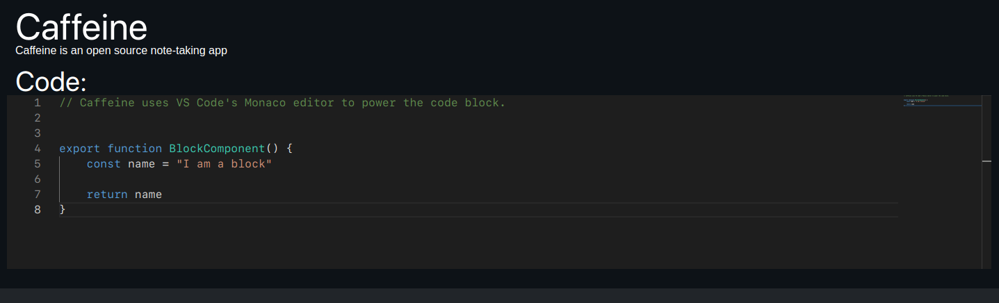

# Caffeine
An open source note-taking app. Work in progress.



# Contribute

You can get test the app by following the next steps.

1. Run `npm install` to download project dependencies.
2. Run `npm run build` to generate production files.
## Run on Windows/MacOS/Linux
1. Run `npm run electron` to start the app.

## Run on iOS (Xcode and macOS required)
1. Run `npx cap add ios` to add the required packages to your project.
2. Run `npx cap run ios` to start the app in a device or simulator.

## Run on Android (Android Studio required)
1. Run `npx cap add android` to add the required packages to your project.
2. Run `npx cap run android` to start the app in a device or emulator.

# Project Structure

```
caffeine
│
│
└───css
│   │   *.scss <- styling for app
│   │
│   └───blocks
│       │   <block name>.scss <- styling for independent blocks
│       │
│
│
└───src
│   └───app
│   │   │   main.ts           <- Electron code for starting the app
│   │   │
│   │   
│   └───preload
│   │   │   preload.ts        <- Code to be executed before loading Electron app
│   │   │
│   │   
│   └───render
│   │   │   note.tsx          <- React component in charge of rendering a note file
│   │   │   renderer.tsx      <- Script in charge of rendering the app
│   │   │
│   │   └───blocks
│   │       │   block.tsx          <- Component in charge of toggling edit/render block
│   │       │   block_editor.tsx   <- Component in charge of rendering editor input box
│   │       │   block_renderer.tsx <- Component in charge selecting proper block renderer
│   │       │   
│   │       └───code
│   │       │   │   *.tsx              <- Code block rendererers (vs_code, code_editor2, etc)
│   │       │   │
│   │       │   
│   │       └───media
│   │       │   │   *.tsx              <- Media block rendererers (image, audio, video)
│   │       │   │
│   │       │   
│   │       └───text
│   │           │   *.tsx              <- Text block rendererers (h1, h2, bullet_point)
│   │           │
│   │   
│   └───watcher
│       │   watcher.ts        <- Refreshes Electron app when changes are detected (unused)
│       │
│
│
└───templates
│   │   index.html <- Webpack uses this template to generate ./dist/index.html
│   │
│
│
└───...

 
```
